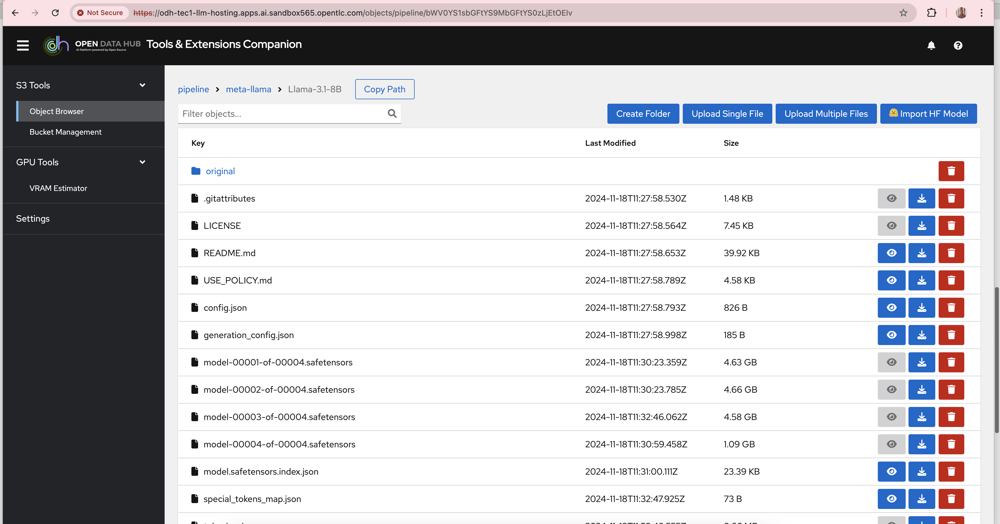
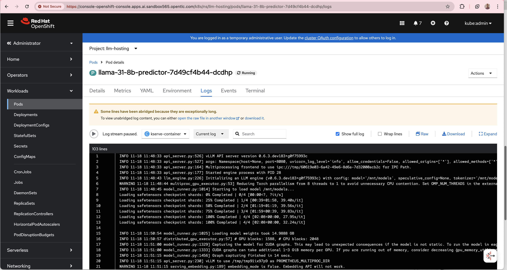
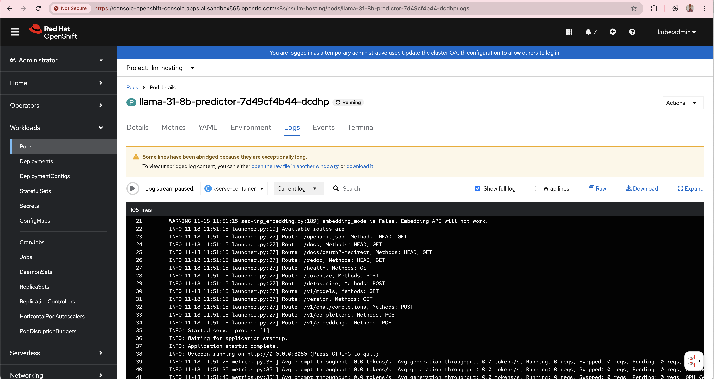
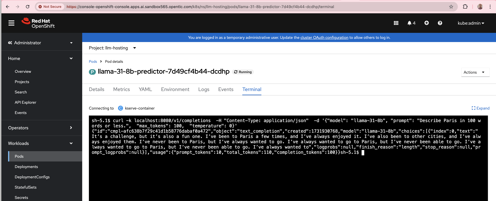
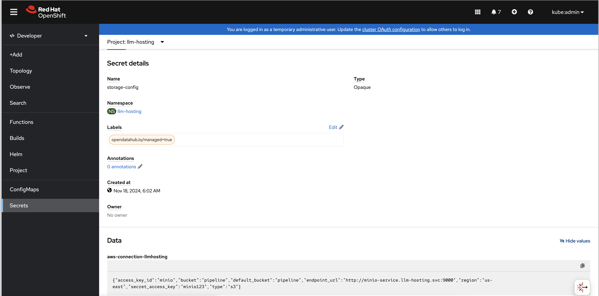

# llama3-rhoai
# Running llama 3 models on Red Hat OpenShift AI(RHOAI)

This guide provides instructions for a quick way of running llama 3 models on OpenShift AI.<br/>

##  Steps

1. Have a running OCP cluster.

2. From Operator hub, install Node Feature Discovery operator. Then create an instance of Node feature discovery<br/>
3. Then, from Operator hub, install NVIDIA GPU Operator. Then create an instance of Cluster Policy<br/>
4. From Operator hub, install Serverless Operator and ServiceMesh 2.x Operator. Dont create any instances<br/>
5. From Operator hub, install Red Hat OpenShift AI operator.<br/>
6. Install minio for s3 storage using https://medium.com/accelerating-ai-innovation-simplifying-ml/accelerating-ai-innovation-simplifying-ml-pipelines-and-inference-with-openshift-ai-9fb2fb32f860 <br/>
7. Install ODH-tech using quay.io/rh-aiservices-bu/odh-tec:latest  <br/>
    https://github.com/opendatahub-io-contrib/odh-tec/tree/main  <br/>
8. Import  model meta-llama/Llama-3.1-8B using  https://github.com/rh-aiservices-bu/models-aas/tree/main?tab=readme-ov-file    <br/>
    <br>
   https://huggingface.co/meta-llama/Llama-3.1-8B has the model. Note: You need to request access for it on Hugging face
9. Start a g5.2xlarge node <br/>

   configure taints/tolerations <br/>
   https://github.com/redhat-na-ssa/hobbyist-guide-to-rhoai/blob/main/docs/05-configure-gpu-sharing-method.md#52-configure-taints-and-tolerations <br/>

   ```
   oc adm taint node ip-10-0-5-51.us-east-2.compute.internal nvidia.com/gpu=:NoSchedule --overwrite
   oc patch clusterpolicy gpu-cluster-policy --type=merge --patch '{"spec":{"daemonsets":{"tolerations":[{"effect":"NoSchedule","operator":"Exists","key":"nvidia.com/gpu"}]}}}'

10. configure RHOAI accelerator profile <br/>
    https://github.com/redhat-na-ssa/hobbyist-guide-to-rhoai/blob/main/docs/08-configure-rhoai.md <br/>

11. Create ServingRuntime and InferenceService on RHOAI
    <br/> [Sample llama 3 vllm file ](sample-llama-31-8b.yml) <br/>

     <br/>
     <br/>


12. Test the llama model using curl command <br/>

     <br/>
    model name in curl command should match with https://github.com/gskumar1010/llama3-rhoai/blob/main/sample-llama-31-8b.yml#L56


    ```
    curl -k localhost:8080/v1/completions  -H "Content-Type: application/json"  -d '{"model": "llama-31-8b", "prompt": "Describe Paris in 100 words or less.",  "max_tokens": 100,  "temperature": 0}' <br/>
    
14. Troubleshooting <br/>
    - If you run into error where llama3-8b-predictor is crashing, check for outofmemory error in the logs <br/>

    - https://github.com/gskumar1010/llama3-rhoai/blob/main/sample-llama-31-8b.yml#L78 should match with Data field in the storage-config secret (done as part of step 6)
    
    
